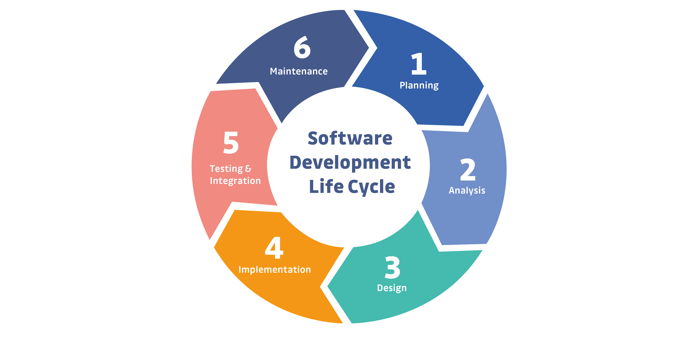
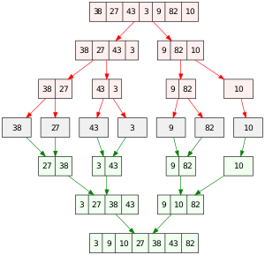

# THEORY QUESTIONS ASSIGNMENT
## Software Stream
### Emma Clokey

##  1. How does Object Oriented Programming differ from Process Oriented Programming?

Object Oriented Programming (OOP) aims to overcome some limitations of Procedural Oriented Programming (POP) by dealing with objects and their properties with a bottom up approach, rather than the POP top down approach which deals with programs divided into functions.
In POP, the top down approach involves the division of a program into functions and sub-functions until each becomes an indivisible unit; each unit contains a set of instructions that will preform a specific task. There is a main controlling procedure which controls a functions execution. Data can be passed through this series of functions, where each will transform its input data into output data; control statements can be used to effect these functions’ sequence dependent on logical conditions or user input requests.  This works well for small programming projects, but modifications to extend to larger projects involves the introduction of multiple independent functions, with multiple arguments, rapidly increasing complexity. POP centers largely around software functionality, rather than data that will be used by the functions.
Conversely, OOP centers around data, allowing a programmer to define it, along with the functions relating to it, creating variables named ‘objects’. The OOP paradigm divides a program based on these objects. Whilst containing elements of POP, OOP has differing features to improve functionality.
Where Data is declared globally within POP, it is able to interact between functions, and thus any function can modify its value, OOP introduces encapsulation, the packing of data and related functions within a single object. Encapsulating the internal state of an object is known as information hiding, an example of this is an objects class. Information hiding stops the internal properties of an object from interacting with unrelated variable within the rest of the program. The ability to hide such data makes OOP a more secure programming approach than POP, and eases the expansion of a program. 
Also, entities of a program in POP are linked through parameter passing, unlike message passing of object functions in OOP. This leaves less room for manual error, for example when modifying data format in POP all functions relating to the data will have to be modified as well. As well as modification, OOP makes the code easier to maintain and debug by facilitating best practices such as less repetition than is needed in POP.
In Addition, OOP supports concepts such as inheritance and polymorphism (discussed below), whereas POP does not. 
Some examples of Process Oriented Programming languages include: C, FORTRAIN and BASIC.
Examples of Object Oriented Programming languages include: C++, Java, Ruby and Python.

## 2. What's polymorphism in OOP?

Polymorphism in Object Oriented Programming refers to the ability of an entity, for example, a function, operator or object to be processed in more than one form, dependent on the scenario. The behavior of the function is determined by the object.
There are different types of polymorphism in OOP: Static Binding (compile time), Dynamic Binding (runtime).
An example of Static Binding polymorphism is method overloading, here, the names may be the same but the parameters are different. 

Operator Overloading
Use of the ‘+’ operator can produce the sum of two integers: 

    num_1 = 10
    num_2 = 9
    print(num_1+num_2)

Output: 19

alternatively it can concatenate two strings:

    string_1 = “Hello “
    string_2 = “World”
    print(string_1+string_2)
    Output: Hello World

Function Overloading
Use of the sorted function can return the elements of a list in a particular order:

    lst = [4, 76, 7, 2, 12, 98]
    lst_2 = sorted(lst)
    print(lst_2)
Output: [2, 4, 7, 12, 76, 98]

alternatively it can sort the order of a string returning a sorted list:

    string = "helloworld"
    string_2 = sorted(string)
    print(string_2)
Output: ['d', 'e', 'h', 'l', 'l', 'l', 'o', 'o', 'r', 'w']

An example of Dynamic Binding polymorphism is method overriding, here the method name and parameters may be similar but the result will differ based on the object; at runtime, the type of object determines the corresponding method called. Creation of methods with the same name but wrapped under different classes show this:

    class Cat:
        def __init__(self, name, age):
            self.name = name
            self.age = age
    
        def speak(self):
            print(f"{self.name} says 'Meow'!")
    
    
    class Dog:
        def __init__(self, name, age):
            self.name = name
            self.age = age
    
        def speak(self):
            print(f"{self.name} says 'Woof'!")
    
    
    my_cat = Cat("Bonnie", 16)
    my_dog = Dog("Alfie", 2)
    my_cat.speak()
    my_dog.speak()
    
    Output:
    Bonnie says 'Meow'!
    Alfie says 'Woof'!

## 3. What's inheritance in OOP?

The division of code into independent functions reduces repetition by promoting code reuse. OOP furthers this with its concept of inheritance, which establishes relationships between objects. Inheritance allows a secondary class of objects to assume the functions and variables of an initial class of objects which may have many identical properties. The new object can retain all the features of the first object, with the ability to then add to or redefine properties, this again eliminates the need for unnecessary repetition, keeping code compact and reusable. In the class case, the parent class object has a more generalised set of characteristics and the child class has a more specific set extending from this, with an ‘is a’ relationship to the parent (e.g. a car ‘is a’ vehicle or a banana ‘is a’ fruit).  If a child class inherits its properties from a single parent class it is termed as single inheritance, if characteristics are acquired from two or more classes it is known as multiple inheritance. 
In the below example, inheritance states that Dog ‘is an’ Animal and so Animal attributes can be applied to the Dog object.

    class Animal:
        def __init__(self, name, age):
            self.name = name
            self.age = age
    
        def intro(self):
            print(f"{self.name} is {self.age} years old.")
    
    
    class Dog(Animal):
        def __init__(self, name, age):
            super().__init__(name, age)
    
    
    my_dog = Dog("Alfie", 2)
    my_dog.intro()

Output: Alfie is 2 years old.

## 4. If you had to make a program that could vote for the top three funniest people in the office, how would you do that? How would you make it possible to vote on those people?

To begin with a full list of names of people in the office should be complied. From here you could loop through user inputs of 3 votes, the loop should continue as many times as voters in the office and add each vote to a newly defined list. By importing pythons counter you can total up the number of votes for each member of staff as  they are voted for and create an output of each member of staff and number of times they were voted for, in descending order to find the top 3. Basic code example below:

    from collections import Counter
    
    staff = ['Emma', 'Emily', 'Ali', 'Shepstone', 'Liv', 'Chinelo']
    
    votes = []
    for staff in staff:
        candidates = ['Emma', 'Emily', 'Ali', 'Shepstone', 'Liv', 'Chinelo']
    
    
        voter = input("What is your name? ")
        candidates.remove(voter)
        vote_1 = input(f"Please enter the funniest member of staff out of {candidates}: ")
        candidates.remove(vote_1)
        votes.append(vote_1)
        vote_2 = input(f"Please enter the second funniest member of staff out of {candidates}: ")
        candidates.remove(vote_2)
        votes.append(vote_2)
        vote_3 = input(f"Please enter the third funniest member of staff out of {candidates}: ")
        candidates.remove(vote_3)
        votes.append(vote_3)
    
        print(votes)
    
        total = Counter(votes)
        print(total)

To improve upon this test would need to be done to make sure value errors were raised in different instances, for example if an employee tried to vote for themselves or misspelt a colleagues name etc. The user should then be taken back to the appropriate place to re enter their input. Also, creation of a user registration with unique user id’s would be beneficial to ensure that the same user does not try to vote multiple times, which would require a connection to a MySQL database which would store this information.

##  5. What's the software development cycle?

The Software Development Life Cycle (SDLC) is a structured process that when followed aids in producing high-quality software with the smallest possible cost and production time, whilst meeting or exceeding all customer requirements. The phases of SDLC (pictured below) aid in project planning/scheduling, providing a standardised framework to define specific business deliverables and so ultimately decreases the risk of a project. 

Generally the SDLC has 6 phases:

- The planning phase is an opportunity to identify any IT requirements that stem from business objectives, these requirements can then be broken down and developed into specific projects with achievable goals. From here, resource allocation (including staffing and training) and project scheduling can be established, inferring reasonable cost and time estimate determinations. This phase will provide an overview of all aspects of a project and involves both the development team and input from any stakeholders involved. In addition to mapping out deliverables of the project, this phase is a time to deduce deliverables that may not be tangible and thus will not be included. 

- Analysis of the proposed system can involve the identification of shortcomings in the planning and provide solutions to be implemented. It can also utilise the pros and cons of any existing system to build upon existing specifications that meet the end user requirements and to remove those that don’t. 

- Designing how the specifications will be transformed into reality during implementation. The focus is on creating software architecture and prototypes, including the design of end user experience. This allows both the development team to have a blueprint to work from and stakeholders to be able to visualise the overall look of the software. The goal here is to best communicate the behaviors and functionality of the system and use it as a tool to agree on project parameters.

- Implementation is executed by coders to bring the concept into reality with the objective of being time efficient, whilst ensuring quality product delivery. Deliverables of the development team are determined in the planning and project scheduling, and based on the approach could mean software is released in one go or in various product increments (e.g. Waterfall/Agile methodologies) 

- Testing and integration phase is an evaluation of the software created. It is an internal confirmation that the end product conforms to the specifications set out in the planning phase, through automated and manual test procedures. This could include, unit testing, code quality, performance and security testing. If any tests are failed at this stage it is the developers task to resolve this and a updated version of the software is produced. 

- The Maintenance phase, post deployment, entails ensuring the continual operation of the end-user product by resolving any issues that may arise. As new technologies are developed and user requirements change, system performance can be reduced, requiring updates. In addition, ongoing monitoring is needed as new security vulnerabilities emerge and so new software requirements need to implemented to align with this. 

Phases of the SDLC can differ slightly from project to project dependent on the software development methodology. The two fundamentals that all projects will include are a start date and end date, the SDLC framework can be implemented differently to systematically get from one to the other. 

##  6. What's the difference between agile and waterfall?

The Waterfall methodology is the most simple, structured of the SDLC models. Each phase is dependent on the resulting tangible output of the phase previous and run in a top down sequence. As the name suggests, it is likened to water flowing down a stream and over waterfalls when each stage concludes. The benefits of a waterfall approach are the ease of milestone definition as their is an obvious achievement at the end of each phase, this also makes it easy to dedicate teams to a phase and so assign responsibility. The waterfall methodology however, does not account for much flexibility as once a phase is completed, going back would adversely affect the delivery time and cost of the project due to having to rework entire functionalities. In addition, this model lacks customer participation and due to the length between proposal and product outcome can often lead to lack of engagement from stakeholders which can be crucial in terms of potential projects success (e.g changing circumstances requiring project negotiations. 

 Whilst Agile methodology still follows the phase framework, there is an ongoing release cycle for any small incremental changes towards the product goal from the previous phase, testing at each increment. This model helps to address minor issues that arise, preventing them from becoming a significant problem down the line. Stakeholders are also more involved during this process, with the ability to provide feedback on the tangible increments produced leading to potential re-evaluation. Due to this, the Agile software life cycle is more change driven as apposed to the Waterfall method being more process driven. The increased customer engagement allows timely feedback and flexibility, increasing project success by ensuring efficiency whilst maintaining a quality deliverables that continually meet customer expectations. Although allowing personal investment from customers, the agile methodology can make it harder to determine the cost/time elements of a project as each phase allows for evolution.  
 

##  7. What is a reduced function used for?

The reduce function is an in built function in python 2 and can be imported in Python 3 from the functools module. The function accepts a function and a sequence with a general syntax of : reduce(function_name, sequence)
and then returns a single value. It does this by using the first two items from the sequence and passing them through the specified function, returning the result. This result is then passed through the function again, this is repeated until only the last return value remains. 

an example of the reduce function:

    from functools import reduce
    def add_nums(a, b)
            return a + b
    
    
    numbers = [1, 2, 3, 4]
    total = reduce(add_nums, numbers)
    print(total)
Output: 10

The reduce function can also pass an optional initialiser, which if defined acts as the first element of the sequence to be iterated through, if not defined the default value is none. 

An example using an initialiser:

    
    from functools import reduce
    def add_nums(a, b)
            return a + b
    
    
    numbers = [1, 2, 3, 4]
    total = reduce(add_nums, numbers, 5)
    print(total)
Output: 15

The reason the reduced function did not remain an inbuilt function in the transition from Python 2 to Python 3 is that there are many alternatives to some uses of the reduce function that provide the same output. In the case of the above example the sum() function will do the same job, and in other cases a simple for loop over an iterable would suffice. 

##  8. How does merge sort work

Merge sort is an algorithm that has been developed to sort the elements within a list to make code searching and selecting more efficient and effective. It is a divide and conquer algorithm concept which splits an original list into even parts and sorts each separated list in this manner repeatedly until finally two sorted sub-lists can be merged back together into a single array. The divide part of the algorithm is handled by list slicing and the conquer uses pointers and indexing of correct nodes to sort.

An example of a merge sort process:

 In the above you can see that after the initial split approximately down the middle, each half if further divided until it reaches the smallest case to evaluate (two elements). These sorted sub arrays are then inversely merged back together to then give the resultant sorted output. 
Merge sort has a worst case performance of O(n log n) (where n is the number of elements to be sorted) meaning it is much more efficient than its counterparts time complexity, for example it does about 30% less comparisons than the quick sort method in an average case. However as it has roughly twice the recursive overhead and its most common implementation does not sort in place, merge sort requires allocated additional memory the size of the input to store the sorted output, unlike the aforementioned quick sort. 

##  9. Generators - Generator functions allow you to declare a function that behaves like an iterator, i.e. it can be used in a for loop. What is the use case?

A generator function returns an iterable object (an object that you can iterate over one value at a time). A generator function looks like a regular function but replaces the return keyword with yield. The yield keyword controls the flow of a generator function and indicates a value being returned to the caller and saving the function state, rather than exiting the function when within a for loop. The yeilded value avoids having to manually save the state between iterations as they are saved and restored automatically. Rather than computing values all at once, the saved state enables a generator to produce a series of values over time, which can optimise memory in the case of longer iterables. 
A generator function can be used to write more concise code when creating an iterator and there is no need for class creation. 
A common usage of generators is for reading lines of large text files (e.g. CSV files) without a memory error. For the example below, the generator function counts the lines in the selected file by yielding each row rather than returning it, as the file is iterated over in a for loop.

    def csv_reader(file_path):
        for row in open(file_path, ‘r’)
            yield row

Another example would be generating an infinite sequence, which due to computer memory would not be possible with a regular function and could only be handled by a generator.

    def infinite_nums():
              num = 0
              while true:
              yield num
              num += 1

This can then be iterated over manually, rather than an infinite execution. 

##  10. Decorators - A page for useful (or potentially abusive?) decorator ideas. What is the return type of the decorator

A decorator is a function whose only argument is another function, it will return a new function with the same name as the original yet with enhanced functionality. Python allows decorators to be applied to methods, functions and classes. These decorators have the same structure; a wrapper function, inside this the original function is called, the wrapper function is returned as the decorator’s result. 
A decorator is defined by writing an ‘@’, followed by the decorator name, at the same level of indentation as the function definition. 
E.g. 

    @decorator_name
    def my_function():
          #function logic

Using a decorator will not modify the existing structure of the original function. A function is known as a first class citizen in python, this means they can be passed into another function as an argument and returned as a value.

if we had a simple hello world function:

    def hello_world()
        return ’hello world’
    
    hello world()
Output: hello world

and a simple decorator function:

    def upper_function(function):
        def wrapper():
          function = function()
          upper_case = function.upper()
          return uppercase
       return wrapper

We can apply this decorator to our hello world function:

    @upper_function 
    def hello_world()
          return ’hello world’
    
    hello world()
Output: HELLO WORLD

Useful decorators include: 
- Timer to check a functions excecution run time
- Authorization decorators to ensure someone is authorised to use the point in web application
- logging the date and time a function was used

Use of too many decorators can make code hard to read, and whilst can add additional features they are not necessary to be implemented at every point they can be.